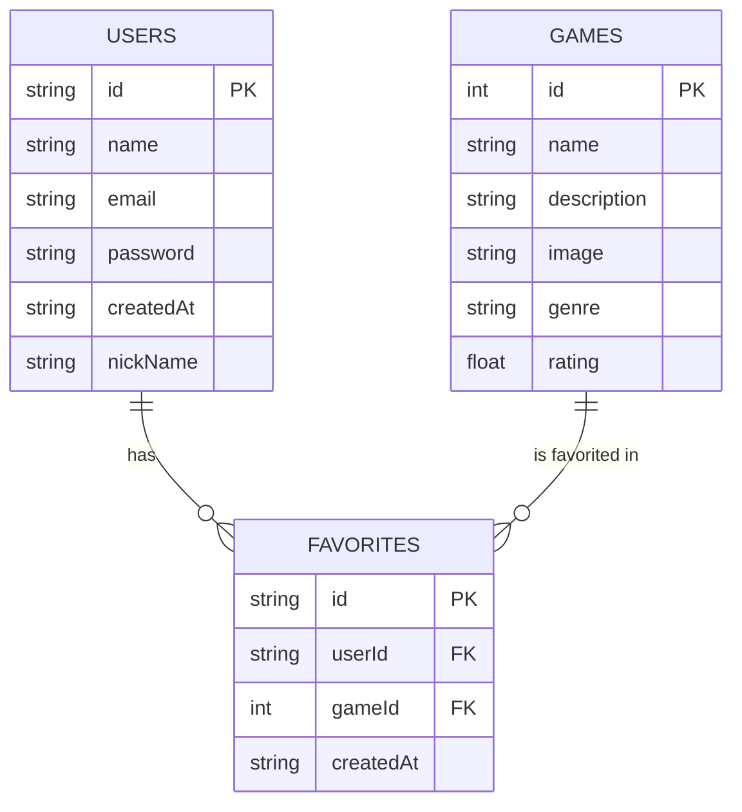

# 🛠️ Especificação Técnica - GameVault

Este documento descreve o modelo de dados da aplicação GameVault, incluindo as entidades e seus relacionamentos.

---

## 1. Modelo de Dados (Diagrama ER)

O sistema é composto por entidades que representam os jogos consumidos de uma API externa e os dados armazenados localmente pelo usuário.

## 2. Dicionário de Dados

Descrição das principais entidades do sistema:

### 👤 USERS

Representa os usuários da aplicação, responsáveis por gerenciar sua biblioteca de jogos.

- id: Identificador único do usuário (gerado automaticamente).
- name: Nome do usuário.
- email: Email utilizado para autenticação (deve ser único).
- password: Senha do usuário.
- nickname: Nome de usuário único utilizado na aplicação.
- createdAt: Data de criação da conta.

### 🎮 GAMES

Representa os jogos consumidos de uma API externa.

- id: Identificador único do jogo (fornecido pela API).
- name: Nome do jogo.
- description: Descrição do jogo.
- image: URL da imagem/capa do jogo.
- genre: Gênero do jogo.
- rating: Avaliação média do jogo.

### ⭐ FAVORITES

Representa os jogos favoritados pelos usuários, funcionando como uma entidade de relacionamento.

- id: Identificador único do registro.
- userId: ID do usuário que favoritou o jogo.
- gameId: ID do jogo favoritado.
- createdAt: Data em que o jogo foi adicionado aos favoritos.
