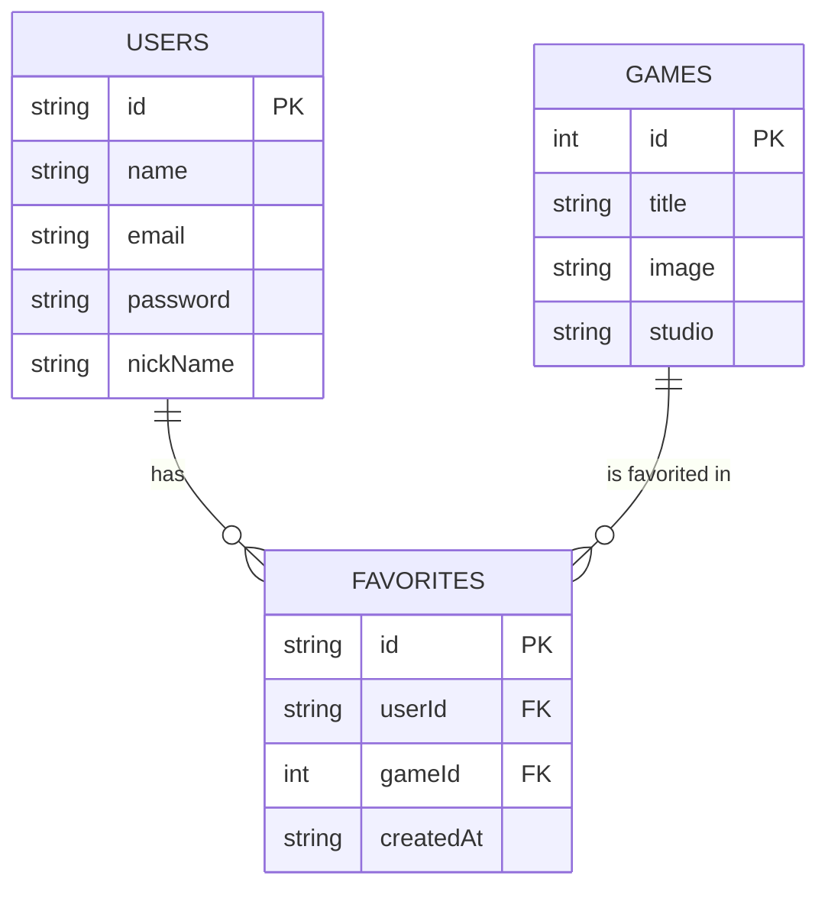

# 🛠️ Especificação Técnica - GameVault

Este documento descreve o modelo de dados da aplicação GameVault, incluindo as entidades e seus relacionamentos.

---

## 1. Modelo de Dados (Diagrama ER)

O sistema é composto por entidades que representam os jogos consumidos de uma API externa e os dados armazenados localmente pelo usuário.

## 2. Dicionário de Dados

Descrição das principais entidades do sistema:

### 👤 USERS

Representa os usuários da aplicação, responsáveis por gerenciar sua biblioteca de jogos.

- id: Identificador único do usuário (gerado automaticamente).
- name: Nome do usuário.
- email: Email utilizado para autenticação (deve ser único).
- password: Senha do usuário.
- nickname: Nome de usuário único utilizado na aplicação.

### 🎮 GAMES

Representa os jogos consumidos de uma API externa.

- id: Identificador único do jogo (fornecido pela API).
- title: Nome do jogo.
- image: URL da imagem/capa do jogo.
- studio: Empresa que desenvolveu o jogo.

### ⭐ FAVORITES

Representa os jogos favoritados pelos usuários, funcionando como uma entidade de relacionamento.

- id: Identificador único do registro.
- userId: ID do usuário que favoritou o jogo.
- gameId: ID do jogo favoritado.
- createdAt: Data em que o jogo foi adicionado aos favoritos.

## 3. Especificação Técnica

Versões das tecnologias escolhidas.

- Bootstrap v5.3.8
- API Pública: RAWG Video Games Database API v1.0

## 4. Design System - Game Vault

Este documento define as especificações técnicas (tokens) para a implementação fiel da interface do Game Vault utilizando Bootstrap 5.

### 4.1 Framework Base

Neste projeto, utilizamos o Bootstrap como framework CSS para acelerar o desenvolvimento do front-end. Ele fornece um sistema de grid responsivo (mobile-first), além de componentes pré-construídos e utilitários que garantem consistência visual e padronização da interface.

### 4.2 Paleta de Cores (Customização)

As variáveis de cor foram escolhidas para construir uma identidade visual dark, imersiva e futurista, alinhada ao universo gamer e à proposta de um vault digital exclusivo:

- **Cor de Fundo — Midnight:** `#09090d`
  - _Uso:_ Base de toda a aplicação. O preto profundo cria máximo contraste com os elementos de destaque e reforça a sensação de um ambiente digital imersivo.

- **Cor de Destaque Principal — Ultraviolet:** `#9d50bb`
  - _Uso:_ Botões primários e elementos interativos de alta ação. O roxo foi escolhido por remeter à estética cyberpunk e futurista, alinhada ao universo gamer.

- **Cor de Destaque Secundária — Secondary Ultraviolet:** `#b96cd8`
  - _Uso:_ Hovers, gradientes e elementos de suporte. Variação mais clara do roxo principal, criando profundidade visual sem perder a consistência da identidade.

- **Superfície de Containers — Black Containers:** `#12121a`
  - _Uso:_ Cards, inputs e contêineres internos. Cria separação visual dos elementos sem quebrar a atmosfera dark da aplicação.

- **Superfície Secundária — Grey Container:** `#1b1b1b`
  - _Uso:_ Contêineres de segundo nível e fundos de seções. Complementa o Black Containers criando hierarquia de profundidade.

- **Texto Principal — Primary Vault:** `#ffffff`
  - _Uso:_ Títulos e textos de alta importância. Branco puro garante legibilidade máxima sobre os fundos escuros.

- **Texto Secundário — Secondary Vault:** `#acabaa`
  - _Uso:_ Labels, informações auxiliares e textos de suporte. Mantém hierarquia visual clara sem competir com o conteúdo principal.

### 4.3. Tipografia

A fonte escolhida foi a Inter em toda a aplicação. Por ser uma fonte de design sistemático e utilitário, transmite precisão e modernidade — características alinhadas à proposta de um vault digital para gamers.
